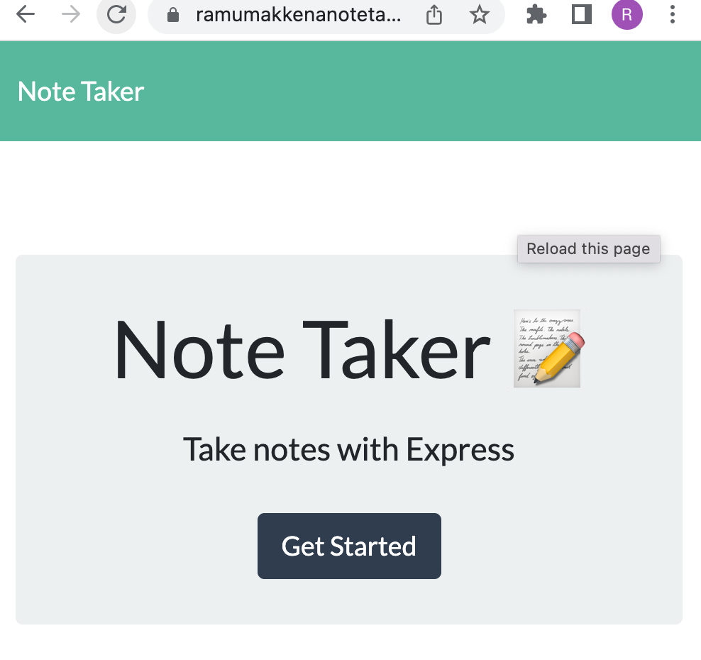
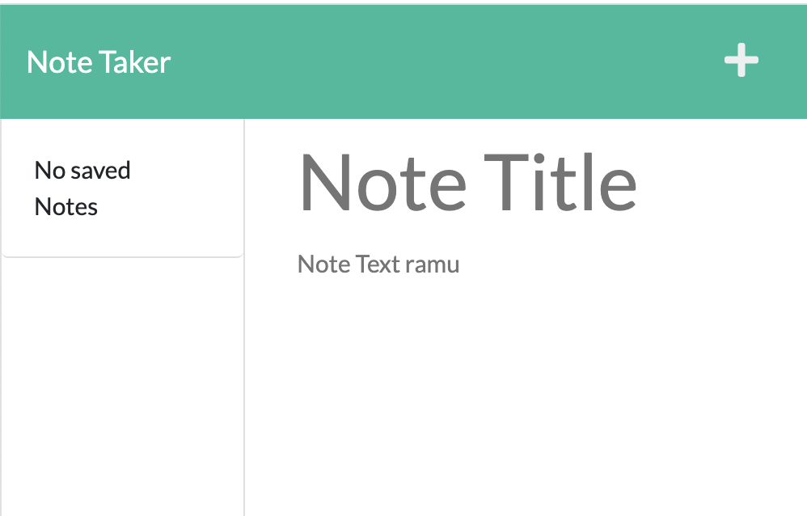
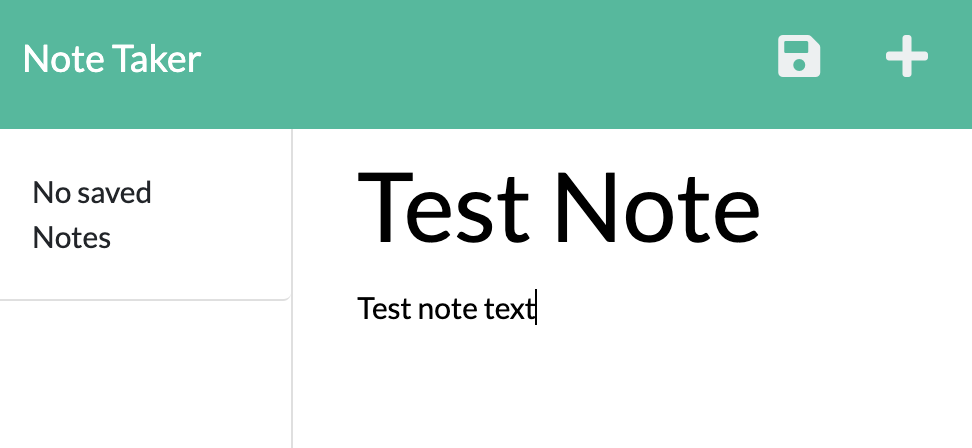
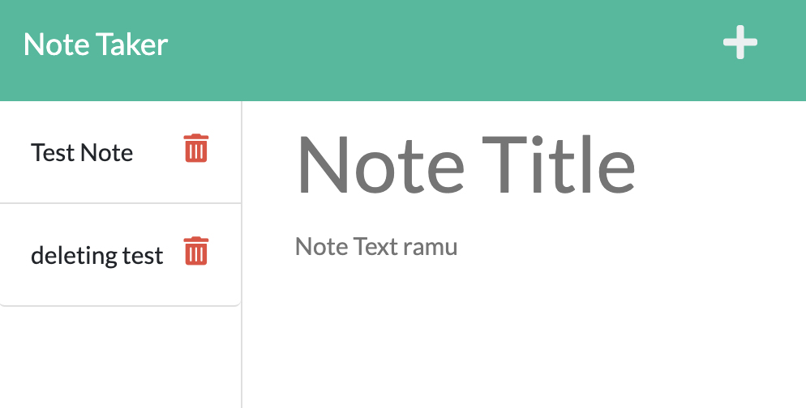
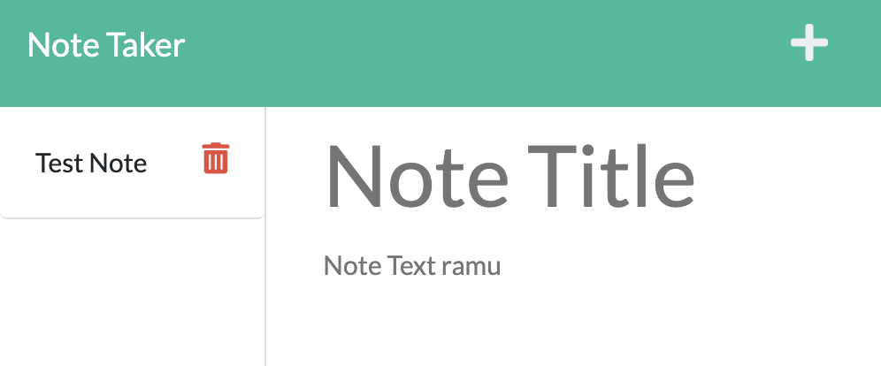

# Notetaker
A note taker application having a backend to store data permanently on server. This application saves all notes at one place entered by anyone. Everyone can see every other's notes. In another words it is a single user application built with a server.

# Installation
npm install

# Usage to run application locally
checkout code
Checkout code.
Run npm install.
run 'node server.js'
access application at http://localhost:3001

# Using deployed version
access application [here](https://ramumakkenanotetaker.herokuapp.com/)

# Technologies or Modules used
nodejs
html
css
express.js
uuid
path

# Contributors
[Ramu Makkena](https://github.com/RamuMakkena)

# Some screens

